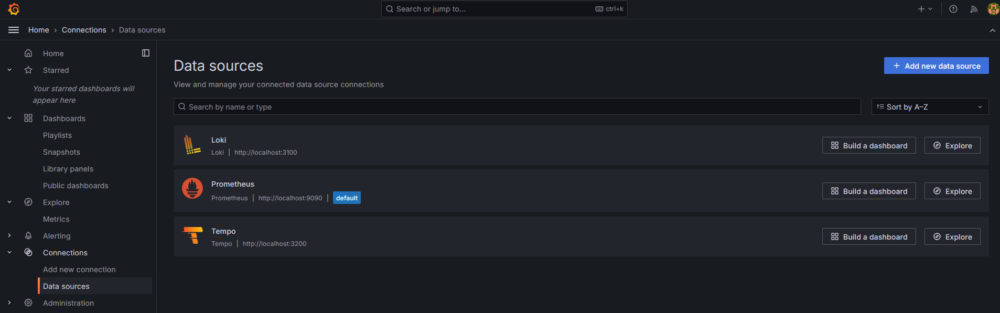
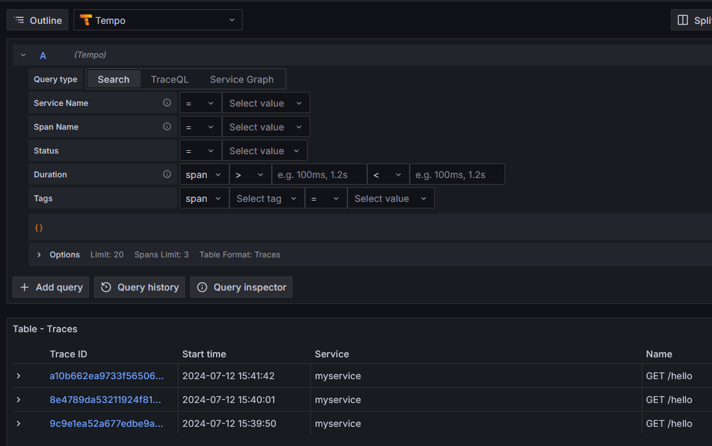
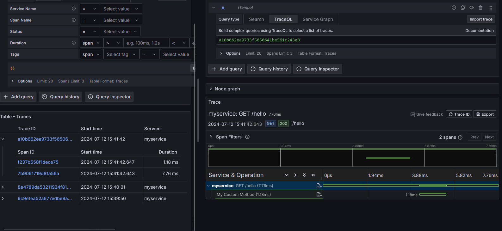

# POC OpenTelemetry + Quarkus

This is a POC to demonstrate how to use OpenTelemetry with Quarkus.

## Requirements

Running Grafana and 
- Prometheus: for metrics
- Loki: for logs
- Tempo: for traces

```bash
$  docker run -p 3000:3000 -p 4317:4317 -p 4318:4318 --rm -ti grafana/otel-lgtm
Waiting for the OpenTelemetry collector and the Grafana LGTM stack to start up...
The OpenTelemetry collector and the Grafana LGTM stack are up and running.
Open ports:
 - 4317: OpenTelemetry GRPC endpoint
 - 4318: OpenTelemetry HTTP endpoint
 - 3000: Grafana. User: admin, password: admin
 ```	

## Configuration

The `application.properties` file contains the configuration for the OpenTelemetry collector.

```properties
quarkus.application.name=myservice
quarkus.otel.exporter.otlp.traces.endpoint=http://localhost:4317
quarkus.otel.exporter.otlp.traces.headers=Authorization=Bearer my_secret
quarkus.log.console.format=%d{HH:mm:ss} %-5p traceId=%X{traceId}, parentId=%X{parentId}, spanId=%X{spanId}, sampled=%X{sampled} [%c{2.}] (%t) %s%e%n
```

## Running the application

```bash
$ mvn compile quarkus:dev
```

## Accessing the application

```bash
$ curl http://localhost:8080/hello | xxd

  % Total    % Received % Xferd  Average Speed   Time    Time     Time  Current
                                 Dload  Upload   Total   Spent    Left  Speed
100    41  100    41    0     0   4016      0 --:--:-- --:--:-- --:--:--  4100
00000000: 6865 6c6c 6f20 3a20 6d79 4375 7374 6f6d  hello : myCustom
00000010: 4d65 7468 6f64 2031 353a 3430 3a30 312e  Method 15:40:01.
00000020: 3337 3936 3131 3733 37                   379611737
```

> The response is displayed in hexadecimal format

## Testing the same endpoint but with GZIP compression :

### Enabling GZIP compression in the application.properties

```properties
quarkus.http.enable-compression=true
quarkus.http.compress-media-types=text/html,text/plain,text/xml,application/json,application/xml
```

```bash 
curl -H "Accept-Encoding: gzip" http://localhost:8080/hello | xxd

  % Total    % Received % Xferd  Average Speed   Time    Time     Time  Current
                                 Dload  Upload   Total   Spent    Left  Speed
100    67  100    67    0     0   6658      0 --:--:-- --:--:-- --:--:--  7444
00000000: 1f8b 0800 0000 0000 0000 ca48 cdc9 c957  ...........H...W
00000010: b052 c8ad 742e 2d2e c9cf f54d 2dc9 c84f  .R..t.-....M-..O
00000020: 5130 34b5 3231 b432 31d2 3333 b1b0 b0b0  Q04.21.21.33....
00000030: 3436 3706 0000 00ff ff03 0074 d4ad ea29  467........t...)
00000040: 0000 00                                  ...
```

## Observations in Grafana

Open Grafana in the browser.

- Click on Data sources, click on Explore on the "Tempo" data source.



- Click on "Search"



- Click on a Trace Id




## The Java Classes

The involved classes are the following:

- `TracedResource`: the REST endpoint, which is automatically traced by OpenTelemetry.

```java
package org.acme.opentelemetry;

import jakarta.ws.rs.GET;
import jakarta.ws.rs.Path;
import jakarta.ws.rs.Produces;
import jakarta.ws.rs.core.MediaType;

import static java.text.MessageFormat.format;

import org.jboss.logging.Logger;

@Path("/")
public class TracedResource {

    private static final Logger LOG = Logger.getLogger(TracedResource.class);

    MyCustomClass customClass;

    public TracedResource(MyCustomClass customClass) {
        super();
        this.customClass = customClass;
    }

    @GET
    @Path("/hello")
    @Produces(MediaType.TEXT_PLAIN)
    public String hello() {
        String message = format("hello : {0}", customClass.myCustomMethod());
        LOG.info(message);
        return message;
    }
}

```

- `MyCustomClass`: a simple class with a method that returns the current time. A Span is created for this method, and it is automatically traced by OpenTelemetry, and attached to the trace context of the REST endpoint.

```java
package org.acme.opentelemetry;

import java.time.LocalTime;

import org.jboss.logging.Logger;

import io.opentelemetry.instrumentation.annotations.WithSpan;
import jakarta.enterprise.context.ApplicationScoped;

@ApplicationScoped
public class MyCustomClass {

    private static final Logger LOG = Logger.getLogger(MyCustomClass.class);

    @WithSpan("My Custom Method")
    public String myCustomMethod() {
        LOG.infov("inside myCustomMethod [{0}]", LocalTime.now());
        return "myCustomMethod " + LocalTime.now();
    }

}
```


